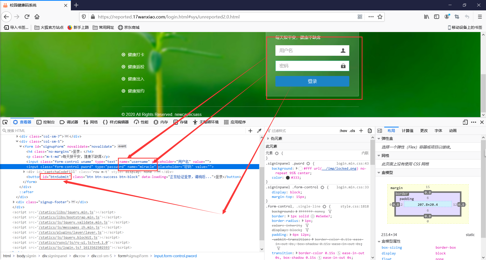
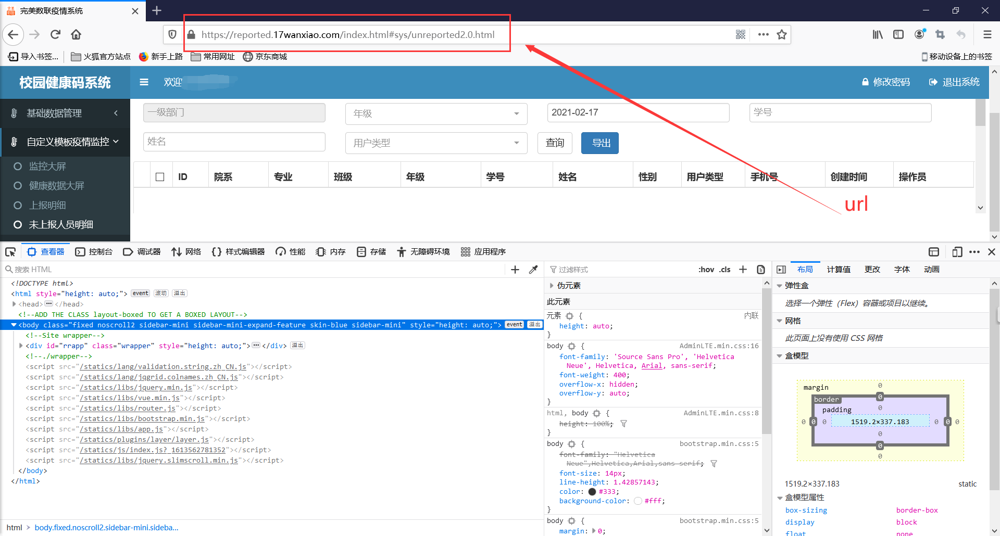
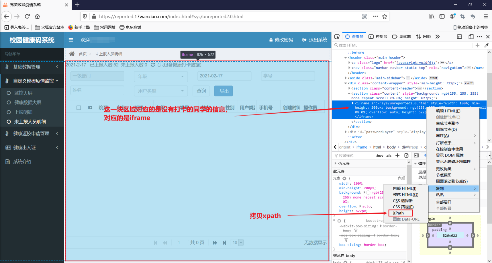
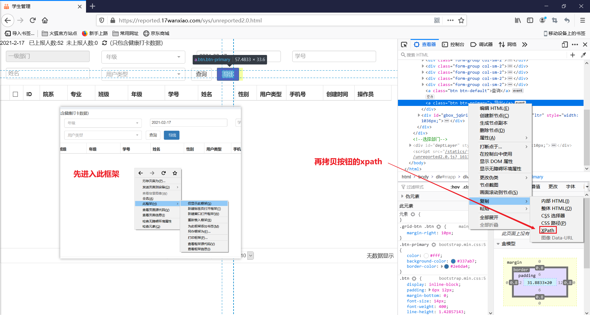
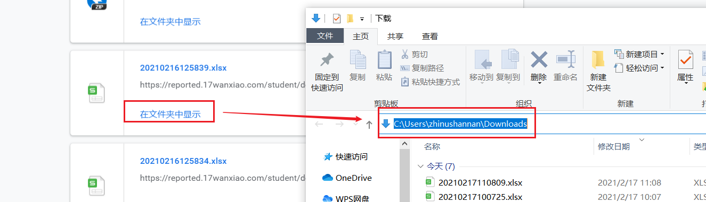
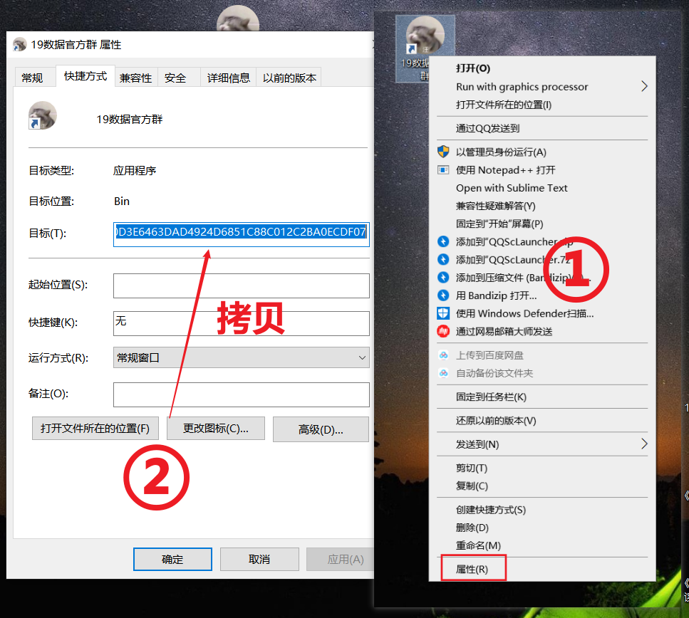

# autobrowser
GitHub链接：[https://github.com/zhinushannan/autobrowser](https://github.com/zhinushannan/autobrowser)
Gitee链接：[https://gitee.com/zhinushannan/autobrowser](https://gitee.com/zhinushannan/autobrowser)
---

# autobrowser
autobrowser是我在寒假期间花费一个半小时写的一个自动提醒全班同学健康打卡的python程序。   

学校要求所有同学每天必须在13点前完成健康打卡，班长就必须配合这项工作，有的时候我比较忙（忙着做梦）忘记提醒打卡，还要在班长群里被点名，很是尴尬，于是写了这样一个程序。

所谓懒人创造世界。

# 代码
python模块：
```python
from selenium import webdriver
import time
import os
import pandas
import subprocess
import win32clipboard as w
import win32con
import datetime
import sys

while True:
    # 需要提醒的时间（这里指的是小时）
    # normal_hour是在这个小时里只需要提醒一次的，danger_hour是提醒两次的
    normal_hour = [7, 10]
    danger_hour = [0, 11, 12, 13, 14]
    # 获取当前时间，精确到小时和分钟
    now = datetime.datetime.now()
    now_hour = now.hour
    now_minute = now.minute

    # 判断当前时间是否为需要提醒的时间段
    # 因为我这个代码是执行一次休眠五分钟，所以我这里的分钟间隔是五分钟
    danger_flag = now_hour in danger_hour and (5 <= now_minute < 10 or 35 <= now_minute < 40)
    normal_flag = now_hour in normal_hour and 5 <= now_minute < 10

    # 当danger_flag和normal_flag其中任一为True时，flag为True，
    # 即执行发送提醒消息的代码
    flag = danger_flag or normal_flag

    # 输出执行时间和是否执行提醒代码
    print(now.strftime("%Y-%m-%d %H:%M:%S"), flag)

    if flag:

        # 打开浏览器，我这里打开的是chrome
        driver = webdriver.Chrome()

        # 控制浏览器打开这个网页
        driver.get('https://reported.17wanxiao.com/login.html')

        # 停顿三秒
        # 目的：1、防止平台检测为爬虫被拦截
        #      2、防止页面元素未完全加载
        # 目的下同
        time.sleep(3)

        # 获取账号和密码的输入框（如图1）并将内容填充
        driver.find_element_by_name('username').send_keys('这里是账号')
        driver.find_element_by_name('miracle').send_keys('这里是密码')
        # 获取登录按钮并点击
        driver.find_element_by_id('btnSubmit').click()

        # 停顿三秒
        time.sleep(3)

        # 进入未打卡明细页面（如图2）
        driver.get('https://reported.17wanxiao.com/index.html#sys/unreported2.0.html')
        
        # 停顿十秒
        time.sleep(10)
        
        # 因为这个页面采用的是iframe内嵌的方式，
        # 所以需要先进入所属的iframe，由于这个
        # 网页的iframe没有id或其他属性，所以这
        # 里直接通过xpath的方式获取（如图3）
        driver.switch_to.frame(driver.find_element_by_xpath('//*[@id="rrapp"]/div[1]/section[2]/iframe'))
        # 获取下载按钮并点击（如图4）
        driver.find_element_by_xpath('/html/body/div[1]/div/div[2]/a[2]').click()

        # 停顿二十秒（因为这个地方需要下载，防止网络波动停顿时间长一点，可以自定义）
        time.sleep(20)

        # file_path是浏览器下载文件的保存位置（如图5）
        file_path = 'C:\\Users\\zhinushannan\\Downloads'
        # 列出目录的下所有文件和文件夹保存到lists并按时间排序
        lists = os.listdir(file_path)  
        lists.sort(key=lambda fn: os.path.getmtime(file_path + "\\" + fn))  
        # 获取最新的文件和他的创建时间
        file_name = os.path.join(file_path, lists[-1])  
        file_time = time.localtime(os.path.getmtime(file_name))

        # 获取还没有打卡的同学的姓名
        data = pandas.read_excel(file_name)['姓名'].values

        # 判断姓名列表的长度，如果长度
        # 等于0，就意味着没打卡的同学
        # 的人数是0即所有人都完成了打
        # 卡，我这里对于所有人完成打卡
        # 的处理方式是直接结束程序
        if len(data) == 0:
            driver.quit()
            sys.exit()

        # 编辑用于发送的消息
        msg = '健康打卡自动提醒\n尚未打卡的同学如下：\n' + \
              str(data) + \
              '\n已打卡的同学请忽略此条消息\n' + \
              time.strftime("%Y-%m-%d %H:%M:%S", file_time) + \
              '\nDesigned By 释治怒   Powered By kwcoder.cn'

        print(msg)

        # 将消息导入粘贴板
        w.OpenClipboard()
        w.EmptyClipboard()
        w.SetClipboardData(win32con.CF_UNICODETEXT, msg)
        w.CloseClipboard()

        # 调用autosend vbscript脚本进行发送操作
        subprocess.call('cscript autosend.vbs')

        # 关闭浏览器
        driver.quit()

    # 休眠五分钟
    time.sleep(300)
```

**图一**

**图二**

**图三**

**图四**

**图五**   

VBScript模块：
```
' 指定执行过程中出错的处理方式
On Error Resume Next

' 创建一个操作对象
Set Wshshell=WScript.CreateObject("WScript.Shell")

' 停顿一秒
WScript.Sleep 1000

' 打开桌面应用程序（聊天窗口的桌面快捷方式，如图6，需要在路径中的双引号之前加一个"）
WshShell.run"""C:\Program Files (x86)\Tencent\QQ\Bin\QQScLauncher.exe"" /uin:1377875184 /quicklunch:DAE2992EB7205B7043A8611627A0F8D54B17D727B40D3E6463DAD4924D6851C88C012C2BA0ECDF07"

WScript.Sleep 1000

' 将粘贴板的内容粘贴
WshShell.SendKeys"^v"

WScript.Sleep 1000

' 发送
WshShell.SendKeys "%s"
```


图六

